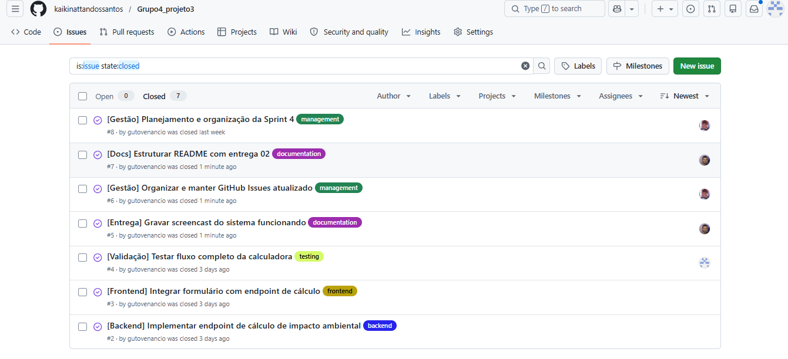
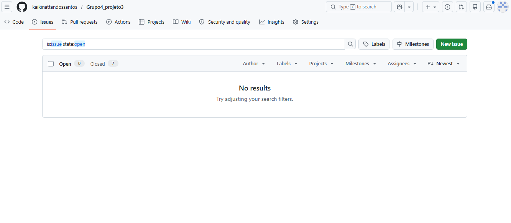

# 🌿 GreenPay Impact

O desafio proposto pela Edenred é criar uma forma de **comparar o impacto ambiental entre transações feitas com cartões físicos e pagamentos digitais**. A ideia é ajudar empresas e clientes a entenderem melhor os benefícios da digitalização das operações, principalmente em relação à redução de emissões de carbono e uso de materiais físicos.

---

## 📌 Proposta

Propomos a criação de uma **calculadora de impacto ambiental** capaz de estimar indicadores como emissões de CO₂, consumo de energia, uso de materiais físicos e impactos logísticos relacionados à produção e distribuição de cartões. A partir dessas estimativas, buscamos permitir **comparações que ajudem a visualizar melhor esses impactos** e entender como a adoção de soluções digitais pode contribuir para a redução desses efeitos.

---

## 👥 Equipe

Para uma melhor qualidade e eficiência no nosso projeto dividimos nossa equipe em 3 grupos sendo eles o de Negócios, Tech e Gestão

### 💼 Negócios
  Responsável por pesquisa de mercado, definição do problema, levantamento de requisitos e construção da proposta de valor do projeto
- André (**afg@cesar.school**)
- Danilo (**dmd@cesar.school**)
- Júlia (**jmc3@cesar.school**)

### 💻 Tech
  Responsável pelo desenvolvimento técnico do projeto, incluindo protótipos, experimentação de tecnologias e implementação das funcionalidades
- Caio (**cme@cesar.school**)
- Kaiki (**knsg@cesar.school**)
- Júlio (**jssn@cesar.school**)

### 📈 Gestão
  Responsável pelo acompanhamento do projeto, organização das entregas, planejamento e comunicação entre os membros da equipe.
- Venâncio (**avvn@cesar.school**)
- Victor (**vlns@cesar.school**)

---

## ⚙️ Fluxo de Versionamento
Para nosso projeto utilizamos baseado em Git Flow Simplificado e Commits Semânticos para uma organização completa do nosso repositório

1. Modelo de Ramificações (Branching Model)

  - `main`: Branch principal e estável, representando o ambiente de produção (MVP). Não são permitidos commits diretos nesta branch. Todo o código deve ser integrado obrigatoriamente via Pull Request, vindo exclusivamente da branch `develop` ou de um `hotfix`.

- `develop`: Branch de integração e homologação. É o ambiente principal de desenvolvimento onde todas as novas funcionalidades se encontram para testes em conjunto antes de irem para a `main`. Commits diretos não são permitidos, necessitando de um Pull Request.

- `feature/`: Utilizada para o desenvolvimento de novas funcionalidades, modelos de dados ou telas. 
  - Regra: Sempre deve ser criada a partir da `develop` e, após a conclusão, o Pull Request deve ser feito de volta para a `develop`.
    - Exemplo: `feature/heatmap-controller`
  
- `bugfix/` ou `hotfix/`: Utilizadas para correções de falhas, bugs e ajustes críticos, com destinos diferentes dependendo da urgência:
  - `bugfix/`: Erros encontrados durante o desenvolvimento ou testes. Ramifica da `develop` e retorna para a `develop`.
  - `hotfix/`: Erros críticos encontrados em produção. Ramifica da `main` e, após corrigido, o Pull Request deve ser enviado para a `main` e também para a `develop` (para garantir que o erro não volte nas próximas atualizações).
    - *Exemplo:* `bugfix/correcao-layout-solicitacao` ou `hotfix/queda-servidor-banco`

2. Padrão de Commits Semânticos

    As mensagens de commit devem ser objetivas e indicar a natureza da alteração, utilizando os seguintes prefixos obrigatórios:
  
    - `feat`: Inclusão de uma nova funcionalidade ou recurso.
    - `fix`: Correção de um bug ou comportamento inesperado no sistema.
    - `style`: Alterações puramente visuais (HTML/CSS) ou de formatação que não afetam a regra de negócio.
    - `docs`: Criação ou atualizações na documentação e comentários do código.

3. Ciclo de Desenvolvimento
   
    O nosso ciclo de desenvolvimento foi desenhado para proteger a estabilidade do sistema e facilitar a colaboração entre toda a equipe,cada nova implementação deve seguir estes passos:

    1. **Sincronização:** Garanta que seu repositório local está sincronizado com a branch de integração (`git checkout develop` seguido de `git pull origin develop`).
    2. **Ramificação:** Crie a branch específica para a sua tarefa a partir da `develop` (ex: `git checkout -b feature/nome-da-tarefa`).
    3. **Desenvolvimento:** Realize as alterações necessárias e efetue os commits seguindo o padrão semântico definido.
    4. **Pull Request (PR):** Após a conclusão da tarefa, envie sua branch para o repositório remoto (`git push origin feature/nome-da-tarefa`) e abra um Pull Request apontando de volta para a branch `develop`.
    5. **Code Review e Merge:** O código deve ser revisado por ao menos um outro membro da equipe. Após a aprovação, o merge é realizado e a branch de feature pode ser descartada
    6. **Lançamento (Release para a Main):** Quando a branch `develop` acumular um conjunto de funcionalidades estáveis e testadas, é aberto um Pull Request final da `develop` para a `main`. Após a aprovação deste merge, a nova versão do sistema entra oficialmente em produção (MVP).

---

## 🚀 Requisitos e Como Executar
Para rodar o projeto localmente, é necessário garantir que o ambiente atenda aos seguintes requisitos técnicos:

### Requisitos Mínimos:

Java JDK 21: Versão utilizada para o desenvolvimento da API.

Maven 3.8+: Para a gestão de dependências e build do projeto.

PostgreSQL: Banco de dados utilizado para a persistência das informações.

### Como Rodar:
1. Configuração do Banco de Dados
    Antes de iniciar a aplicação, você deve criar um banco de dados no PostgreSQL com as seguintes configurações:

    Nome do Banco: edenred_db

    Usuário: postgres

    Senha: 3456

2. Execução
    Clone o repositório e navegue até a pasta calculadora.

    Certifique-se de que o PostgreSQL está rodando.

    Execute o comando Maven para iniciar o Spring Boot:
   
    ./mvnw spring-boot:run
   
    Acesse a interface web em: http://localhost:8081/index.html.
   
---

## Entrega 1

  ### Histórias do Usuário
  
  [link para o FigJam](https://www.figma.com/board/lZy6lebsYlZyLumOq8trZp/FigJam-Projetos-3?node-id=267-34&p=f&t=jocHJL0BniD9Rgao-0)
  
  ### Protótipo Lo-Fi
  [link para o Figma](https://www.figma.com/proto/fqkOwTo6V06bIYWxXAWMGQ/Sem-t%C3%ADtulo?node-id=1-2&t=qqkqD9rIfS0p9XTp-1&scaling=min-zoom&content-scaling=fixed&page-id=0%3A1&starting-point-node-id=1%3A2)
  
  ### Screencast Lo-Fi
  [link para o Screencast Lo-Fi](https://youtu.be/W4GPjuBF4Xc)

---

## Entrega 2

  ### Issue/Bug Tracker
  O acompanhamento das tarefas foi feito pelo GitHub Issues, onde registramos e finalizamos todas as atividades desta entrega. O quadro está 100% concluído, sem pendências abertas.
  #### Organização por Categorias
Para garantir a rastreabilidade das alterações e a organização das responsabilidades, as tarefas foram segmentadas através de etiquetas específicas:

`backend`: Implementação das regras de negócio, persistência de dados e cálculo de impacto em Java.

`frontend`: Desenvolvimento da interface web e integração de conectividade via API.

`testing & validation`: Baterias de testes do fluxo completo para garantir a acurácia dos cálculos.

`documentation`: Estruturação técnica do README e suporte aos materiais de entrega.

`management`: Planeamento das sprints e controlo de organização do repositório.
  #### Evidências
  **Histórico de tarefas finalizadas:**

**Quadro de atividades atual:**

  ### Screencast 
  [link para o Screencast](https://youtu.be/1URsS2YSoAY)
