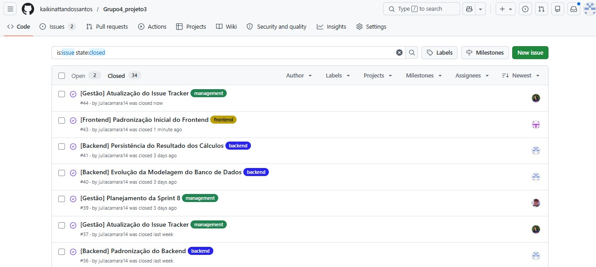
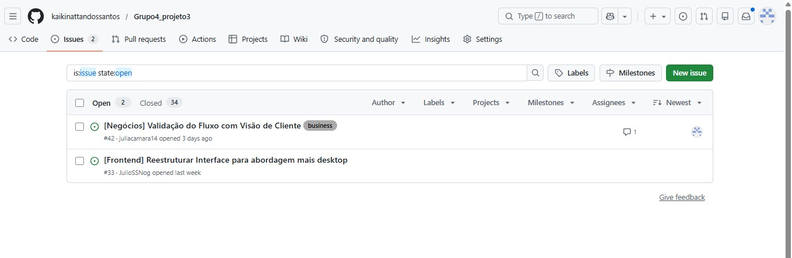

# 🌿 GreenPay Impact

O desafio proposto pela Edenred é criar uma forma de **comparar o impacto ambiental entre transações feitas com cartões físicos e pagamentos digitais**. A ideia é ajudar empresas e clientes a entenderem melhor os benefícios da digitalização das operações, principalmente em relação à redução de emissões de carbono e uso de materiais físicos.

---

## 📌 Proposta

Propomos a criação de uma **calculadora de impacto ambiental** capaz de estimar indicadores como emissões de CO₂, consumo de energia, uso de materiais físicos e impactos logísticos relacionados à produção e distribuição de cartões. A partir dessas estimativas, buscamos permitir **comparações que ajudem a visualizar melhor esses impactos** e entender como a adoção de soluções digitais pode contribuir para a redução desses efeitos.

---

## 👥 Equipe

Para uma melhor qualidade e eficiência no nosso projeto dividimos nossa equipe em 3 grupos sendo eles o de Negócios, Tech e Gestão

### 💼 Negócios
  Responsável por pesquisa de mercado, definição do problema, levantamento de requisitos e construção da proposta de valor do projeto
- André (**afg@cesar.school**)
- Danilo (**dmd@cesar.school**)
- Júlia (**jmc3@cesar.school**)

### 💻 Tech
  Responsável pelo desenvolvimento técnico do projeto, incluindo protótipos, experimentação de tecnologias e implementação das funcionalidades
- Caio (**cme@cesar.school**)
- Kaiki (**knsg@cesar.school**)
- Júlio (**jssn@cesar.school**)

### 📈 Gestão
  Responsável pelo acompanhamento do projeto, organização das entregas, planejamento e comunicação entre os membros da equipe.
- Venâncio (**avvn@cesar.school**)
- Victor (**vlns@cesar.school**)

---

## ⚙️ Fluxo de Versionamento
Para nosso projeto utilizamos baseado em Git Flow Simplificado e Commits Semânticos para uma organização completa do nosso repositório

1. Modelo de Ramificações (Branching Model)

  - `main`: Branch principal e estável, representando o ambiente de produção (MVP). Não são permitidos commits diretos nesta branch. Todo o código deve ser integrado obrigatoriamente via Pull Request, vindo exclusivamente da branch `develop` ou de um `hotfix`.

- `develop`: Branch de integração e homologação. É o ambiente principal de desenvolvimento onde todas as novas funcionalidades se encontram para testes em conjunto antes de irem para a `main`. Commits diretos não são permitidos, necessitando de um Pull Request.

- `feature/`: Utilizada para o desenvolvimento de novas funcionalidades, modelos de dados ou telas. 
  - Regra: Sempre deve ser criada a partir da `develop` e, após a conclusão, o Pull Request deve ser feito de volta para a `develop`.
    - Exemplo: `feature/heatmap-controller`
  
- `bugfix/` ou `hotfix/`: Utilizadas para correções de falhas, bugs e ajustes críticos, com destinos diferentes dependendo da urgência:
  - `bugfix/`: Erros encontrados durante o desenvolvimento ou testes. Ramifica da `develop` e retorna para a `develop`.
  - `hotfix/`: Erros críticos encontrados em produção. Ramifica da `main` e, após corrigido, o Pull Request deve ser enviado para a `main` e também para a `develop` (para garantir que o erro não volte nas próximas atualizações).
    - *Exemplo:* `bugfix/correcao-layout-solicitacao` ou `hotfix/queda-servidor-banco`

2. Padrão de Commits Semânticos

    As mensagens de commit devem ser objetivas e indicar a natureza da alteração, utilizando os seguintes prefixos obrigatórios:
  
    - `feat`: Inclusão de uma nova funcionalidade ou recurso.
    - `fix`: Correção de um bug ou comportamento inesperado no sistema.
    - `style`: Alterações puramente visuais (HTML/CSS) ou de formatação que não afetam a regra de negócio.
    - `docs`: Criação ou atualizações na documentação e comentários do código.

3. Ciclo de Desenvolvimento
   
    O nosso ciclo de desenvolvimento foi desenhado para proteger a estabilidade do sistema e facilitar a colaboração entre toda a equipe,cada nova implementação deve seguir estes passos:

    1. **Sincronização:** Garanta que seu repositório local está sincronizado com a branch de integração (`git checkout develop` seguido de `git pull origin develop`).
    2. **Ramificação:** Crie a branch específica para a sua tarefa a partir da `develop` (ex: `git checkout -b feature/nome-da-tarefa`).
    3. **Desenvolvimento:** Realize as alterações necessárias e efetue os commits seguindo o padrão semântico definido.
    4. **Pull Request (PR):** Após a conclusão da tarefa, envie sua branch para o repositório remoto (`git push origin feature/nome-da-tarefa`) e abra um Pull Request apontando de volta para a branch `develop`.
    5. **Code Review e Merge:** O código deve ser revisado por ao menos um outro membro da equipe. Após a aprovação, o merge é realizado e a branch de feature pode ser descartada
    6. **Lançamento (Release para a Main):** Quando a branch `develop` acumular um conjunto de funcionalidades estáveis e testadas, é aberto um Pull Request final da `develop` para a `main`. Após a aprovação deste merge, a nova versão do sistema entra oficialmente em produção (MVP).

---

### ✨ Arquitetura e Principais Funcionalidades

O projeto evoluiu para uma arquitetura de API RESTful robusta, focada em rastreabilidade de dados ESG e experiência do usuário (UX) corporativa B2B.

* **Persistência e Rastreabilidade (Auditoria ESG):** Todo cálculo gerado é gravado de forma imutável no banco de dados. O sistema congela o ID exato do Fator de Emissão que estava vigente no milissegundo da simulação, garantindo que o histórico nunca seja corrompido caso os referenciais matemáticos mudem no futuro.
* **Modelagem de Dados Normalizada:** O banco de dados foi estruturado com base em 4 entidades altamente coesas:
  * `Empresa`: Cadastro puramente comercial (focado em fluxo opcional).
  * `FatorEmissao`: Motor matemático com suporte a *Soft Delete* (arquivamento de versões obsoletas).
  * `FatorConversaoAnalogia`: Parametrização 100% dinâmica das analogias científicas (Árvores, Km, Garrafas PET), eliminando valores chumbados (*hardcoded*) no código.
  * `ResultadoCalculo`: Entidade central que une transações, resultados brutos, equivalências e a data exata.
* **Cálculo Expresso (Foco em Conversão):** A API foi refatorada para aceitar simulações anônimas. O usuário preenche apenas o volume de transações, reduzindo o atrito (barreira de entrada) e gerando um relatório inteligente de "Simulação Expressa".
* **Busca Instantânea em Memória:** A modal de histórico no frontend conta com um filtro reativo (`onkeyup`) que pesquisa por Nome Fantasia e CNPJ em tempo real, sem sobrecarregar o banco de dados.

---

### 🚀 Requisitos e Como Executar

####  Pré-requisitos Técnicos
Antes de rodar a aplicação localmente, certifique-se de ter instalado em sua máquina:
* **Java JDK 21**: Ambiente de execução e compilação da API Spring Boot.
* **Maven 3.8+**: Gerenciador de dependências (opcional, visto que o projeto já inclui o utilitário nativo `mvnw`).
* **PostgreSQL**: Banco de dados relacional para a persistência e rastreabilidade das simulações.

####  1. Configuração do Banco de Dados
A aplicação utiliza persistência automatizada e parametrização dinâmica de dados. Antes de iniciar o servidor, configure o seu ambiente local no PostgreSQL:

1. Crie um banco de dados vazio com o nome exato de: `edenred_db`
2. Certifique-se de que as credenciais do seu serviço PostgreSQL correspondem às configurações padrão do projeto:
   * **Usuário:** `postgres`
   * **Senha:** `3456`

> ** Nota de Praticidade:** Não é necessário executar nenhum script SQL manual para criar tabelas ou inserir registros iniciais. Graças à propriedade `ddl-auto=update` do Spring Data JPA e ao componente automático `DataInitializer`, toda a estrutura relacional (tabelas de empresas, histórico de resultados de cálculos, fatores de emissão e analogias científicas) é gerada e populada com os dados de referência no exato momento em que a aplicação é iniciada pela primeira vez.

####  2. Como Executar a Aplicação

1. Abra o seu terminal e navegue até a pasta raiz do projeto:
```bash
cd calculadora
```
2. Certifique-se de que o serviço do seu PostgreSQL está ativo e rodando em segundo plano.
3. Execute o comando do Maven Wrapper para compilar o ecossistema e iniciar o servidor embutido do Spring Boot:
```bash
./mvnw spring-boot:run
```
4. Aguarde a mensagem de confirmação no console indicando que o Tomcat foi iniciado com sucesso na porta **8081**.

####  3. Acesso à Interface do Usuário

Com o servidor backend ativo, abra o seu navegador de preferência e acesse o endereço do ecossistema modular:
```url
http://localhost:8081/
```
*(Caso queira acessar o arquivo estático diretamente pelo mapeamento, utilize: `http://localhost:8081/index.html`)*

---

## Entrega 1

  ### Histórias do Usuário
  
  [link para o FigJam](https://www.figma.com/board/lZy6lebsYlZyLumOq8trZp/FigJam-Projetos-3?node-id=267-34&p=f&t=jocHJL0BniD9Rgao-0)
  
  ### Protótipo Lo-Fi
  [link para o Figma](https://www.figma.com/proto/fqkOwTo6V06bIYWxXAWMGQ/Sem-t%C3%ADtulo?node-id=1-2&t=qqkqD9rIfS0p9XTp-1&scaling=min-zoom&content-scaling=fixed&page-id=0%3A1&starting-point-node-id=1%3A2)
  
  ### Screencast Lo-Fi
  [link para o Screencast Lo-Fi](https://youtu.be/W4GPjuBF4Xc)

---

## Entrega 2

  ### Issue/Bug Tracker
  O acompanhamento das tarefas foi feito pelo GitHub Issues, onde registramos e finalizamos todas as atividades desta entrega. O quadro está 100% concluído, sem pendências abertas.
  #### Organização por Categorias
Para garantir a rastreabilidade das alterações e a organização das responsabilidades, as tarefas foram segmentadas através de etiquetas específicas:

`backend`: Implementação das regras de negócio, persistência de dados e cálculo de impacto em Java.

`frontend`: Desenvolvimento da interface web e integração de conectividade via API.

`testing & validation`: Baterias de testes do fluxo completo para garantir a acurácia dos cálculos.

`documentation`: Estruturação técnica do README e suporte aos materiais de entrega.

`management`: Planeamento das sprints e controlo de organização do repositório.
  #### Evidências
  **Histórico de tarefas finalizadas:**


**Quadro de atividades atual:**


  ### Screencast 2
  [link para o Screencast](https://youtu.be/1URsS2YSoAY)

---

## Entrega 3
  
  ### Novas Funcionalidades
  Nesta entrega, focamos em transformar a calculadora numa ferramenta consultiva para os executivos da Edenred, implementando:
  - **Histórico de Cálculos:** Visualização de simulações passadas com capacidade de revisualização de dados.
  - **Relatório Executivo (PDF):** Exportação limpa e profissional dos resultados e analogias para apresentação a clientes B2B.

  ### Issue/Bug Tracker
  O acompanhamento das tarefas foi feito novamente pelo GitHub Issues, estamos sempre utilizando ele como referência e incentivando o uso ativo.
  
  **Histórico de tarefas finalizadas:**


**Quadro de atividades atual:**


  ### Screencast 3
  [link para o Screencast](https://youtu.be/5nE5RElzUXQ)
  
  ---

 ## Entrega 4
  
### Evolução da Plataforma
Nesta etapa, consolidamos a maturidade arquitetural da calculadora e aprimoramos as ferramentas de auditoria ESG e usabilidade B2B para os executivos da Edenred, implementando:
- **Busca Instantânea no Histórico:** Inclusão de um filtro reativo em tempo real (`onkeyup`) na modal de listagem, permitindo localizar análises passadas de forma ágil digitando apenas trechos do Nome Fantasia ou CNPJ da empresa.
- **Parametrização Dinâmica de Fatores & Analogias:** Migração completa das métricas e equivalências científicas (árvores, quilômetros e garrafas PET) de constantes chumbadas (*hardcoded*) no código para tabelas dedicadas no PostgreSQL, viabilizando atualizações de conformidade sem necessidade de novos *deploys*.
- **Histórico Automático & Persistência:** Persistência permanente de toda simulação realizada na tabela do banco, congelando a fotografia exata dos fatores vigentes no milissegundo do cálculo para garantir rastreabilidade à auditoria.
- **Gestão e Atualização de Fatores de Emissão:** Criação de um painel administrativo para inserção de novos referenciais científicos e metodologias (ex: GHG Protocol). O sistema arquiva automaticamente as versões obsoletas (*soft delete*), mantendo a integridade e rastreabilidade dos cálculos antigos.


  ### Issue/Bug Tracker
  O acompanhamento das tarefas foi feito novamente pelo GitHub Issues, estamos sempre utilizando ele como referência e incentivando o uso ativo.
  
  **Histórico de tarefas finalizadas:**


**Quadro de atividades atual:**


  ### Screencast 4
  [link para o Screencast](https://youtu.be/51KsWhH2UIw?si=riOcFOz8eDW5vQ3p)

